# Drug Checking Visualization Framework — Review Sheet

Working document for auditing all standalone charts in `visualization-framework/viz/`. Each entry lists the chart name, coloration, rendering logic, a screenshot of the `#stage` component, and space to note changes.

**Previews:** `review-previews/` (regenerate with `python _capture_previews.py` while `python -m http.server 8765` is running in this folder).

**Shared UI palette (DCF `TOKENS`):** dark page chrome — `bg #0b0e14`, `panel #121826`, `ink #e8ecf4`, `muted #8b94a8`. Substance classes via `classify()`: fent `#ff5c7a`, opioid `#ff8a5c`, xyl `#b388ff`, stim `#ffd166`, coke `#4cc9f0`, benzo `#7aa2ff`, cut `#6ee7a8`, other `#94a3b8`. Semantic: `ok #6ee7a8`, `watch #ffd166`, `alert #ff5c7a`, `info #4cc9f0`.

---

## 01 · Spectral Mirror Match

**File:** `01-mirror-match.html` · **Tag:** Nº 01 · MS

**Coloration:** Dark TOKENS shell. Sample and reference stick peaks use `classify()` colors; matched ions at full opacity, unmatched in `TOKENS.faint`. Verdict badge: `TOKENS.ok` / `TOKENS.watch` / `TOKENS.alert` by cosine score.

**Logic:** D3 mirror mass-spectrum plot. Two dropdowns pick submitted vs library substances from `SPEC.ms`; optional noise toggle jitters the sample. `stickSpectrum()` + `cosine()` score matched fragments; hover tooltips on m/z.

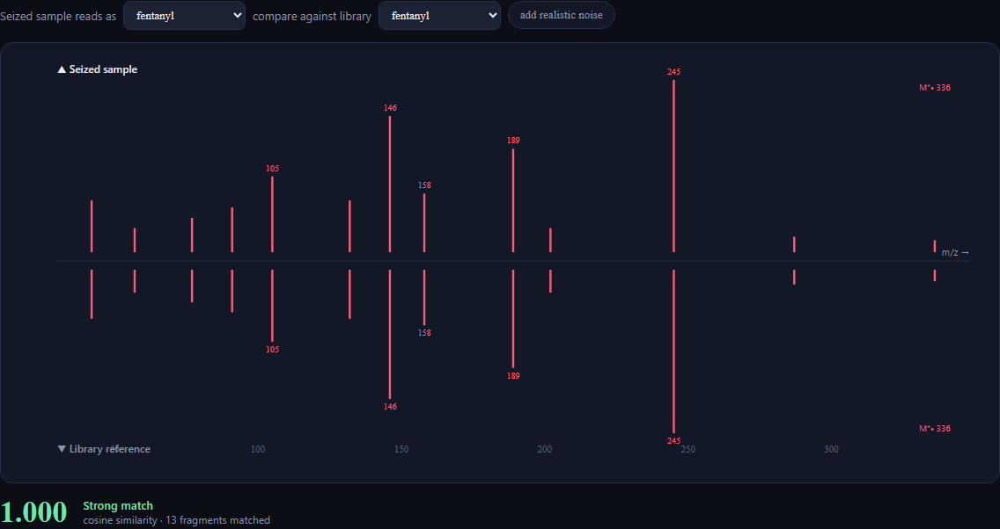

**Changes needed:**

---

## 02 · Annotated Chromatogram Explorer

**File:** `02-chromatogram-explorer.html` · **Tag:** Nº 02 · GC–MS

**Coloration:** Trace fill/stroke in `TOKENS.info` (blue). Peak markers and labels use per-substance `classify()` colors; selected peak enlarges. Detail panel sticks and structure card border follow selected class color.

**Logic:** D3 interactive chromatogram from `SPEC.chromatograms` archetypes and real retention times via `chromatogram()`. Click a peak for plain-language notes, mini mass spectrum, and SmilesDrawer structure. Sample dropdown switches archetype.

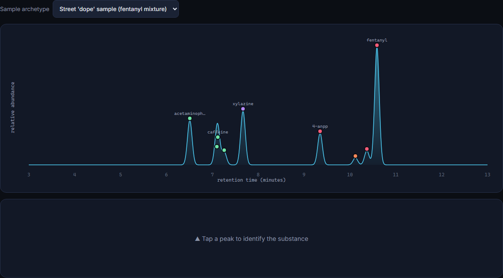

**Changes needed:**
Create 2 further variations using more instructive and dynamic layout and labelling to reduce clutter and enhance clarity.
---

## 03 · FTIR Overlay & Subtraction Bench

**File:** `03-ftir-overlay.html` · **Tag:** Nº 03 · FTIR

**Coloration:** Fingerprint region shaded `TOKENS.panel2`. Total mixture dashed `TOKENS.muted`; subtracted references `TOKENS.faint`. Residual signal filled with `TOKENS.fent` gradient, stroked `TOKENS.fent`.

**Logic:** Sums `SPEC.ftir` band lists into synthetic curves via `ftirCurve()`. Toggle chips add/remove mixture components and subtracted references. D3 overlay with reversed wavenumber axis; mousemove tooltip.

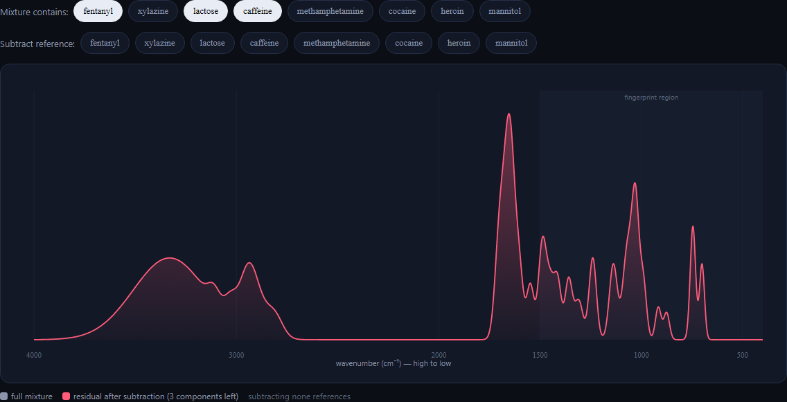

**Changes needed:**
Needs to be altered to explain and visualize concept of subtraction further
---

## 04 · Fragmentation Radial

**File:** `04-fragment-tree.html` · **Tag:** Nº 04 · MS

**Coloration:** Central M⁺ node and fragment spokes use `classify(selected).color`. Concentric m/z guide rings in `TOKENS.line` / `TOKENS.faint` / `TOKENS.muted`.

**Logic:** D3 radial layout maps fragment m/z to radius and abundance to spoke length/opacity from `SPEC.ms`. Substance dropdown; hover tooltips show m/z and relative intensity.

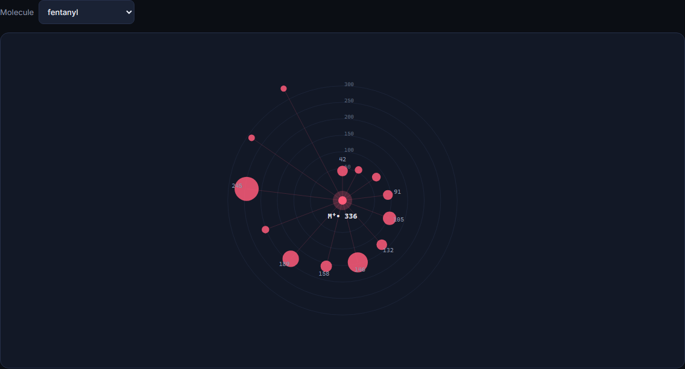

**Changes needed:**
This is too abstract and does not convey meaningful data, replace it with another attempt to convey the same concept.
---

## 05 · GC–MS Data Cube (3D)

**File:** `05-chromatogram-3d.html` · **Tag:** Nº 05 · GC–MS

**Coloration:** Three selectable schemes — **Night** (dark `#0b0e14` → `#ffd166`), **Clinical** (light blue/teal), **Paper** (warm cream/lavender). Each scheme updates Plotly colorscale, 3D scene background, and `#viz-panel` chrome. Height encoded by colorscale, not per-substance class.

**Logic:** Plotly 3D surface: retention time × m/z × signal synthesized via Gaussian convolution of chromatogram peaks and stick spectra. Sample dropdown rebuilds surface; color scheme and view buttons (top-down / X-axis / Y-axis) set camera and palette.

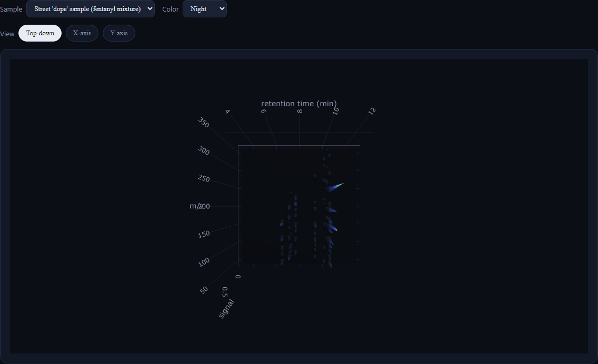

**Changes needed:**
This should be a central focus for creating variations. The 3d space is styled too mathematically and should include a top-down, x-axis, and y-axis selector as well as orbit and zoom. Include a 2d chromatogram below it so that as the user moves around and highlights peaks in the 3d space it locates it in the 2d space.
---

## 06 · Batch Ridgeline Fingerprints

**File:** `06-spectral-ridgeline.html` · **Tag:** Nº 06 · GC–MS

**Coloration:** Each ridgeline tinted by `classify()` color of that row's dominant peak (16% fill, full stroke). Grid/labels in `TOKENS.line`, `TOKENS.faint`, `TOKENS.muted`. Stable vs volatile modes share palette, differ in peak composition.

**Logic:** Procedurally generates 22 sample chromatograms from seeded RNG using real retention times. D3 stacked overlapping ridgelines; toggle switches stable fentanyl market vs volatile transition with emergent bromazolam.

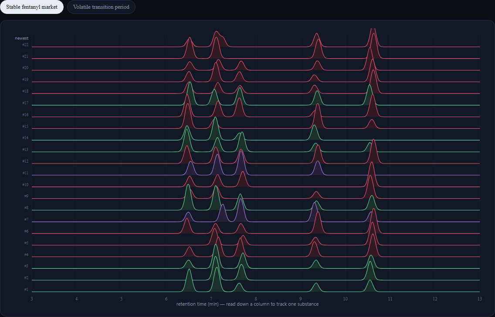

**Changes needed:**
make a version with all of the samples included and a 3d dynamic view.
Make this dynamic and use labels for the column of drug matches, when a user hovers over or clicks on a particular drug then show a line that appears vertically down the column tracing the mean, median, min and max for that drug, with coloration from red to green based with red indicating a larger variation of the samples within that.

Create a similar version that is 3d where the user can select a particular drug range and have it zoom in slightly and show a volume of space that links the peaks of each line in a column with a green central 'path' representing the 10% most consistent variability and further to the sides the swerve of more variable samples. Use a simple physics simulation to 'shoot' a ball which swerves in periods of more variation and stays closer on the path when there is more consistency.

Also create a sound-scape version of this chart by mapping harmonic tones to the more consistent curves and slightly more dissonant tones to the variable ones, so that by selecting a column one can hear a melody with each line being a .5 second tone and each curve being slightly haloe'd when that lines tone is being played.

---

## 07 · FTIR Waterfall (3D)

**File:** `07-ftir-waterfall.html` · **Tag:** Nº 07 · FTIR

**Coloration:** Plotly colorscale `#0b0e14` → `#3a2a5a` → `#7a5cff` → `#b388ff` → `#ffd166`. Dark scene axes/grid on `#0b0e14`. No `classify()` mapping.

**Logic:** Plotly 3D surface from monthly FTIR curves (wavenumber × month × absorbance). Orbit/zoom; wavenumber axis reversed to FTIR convention.

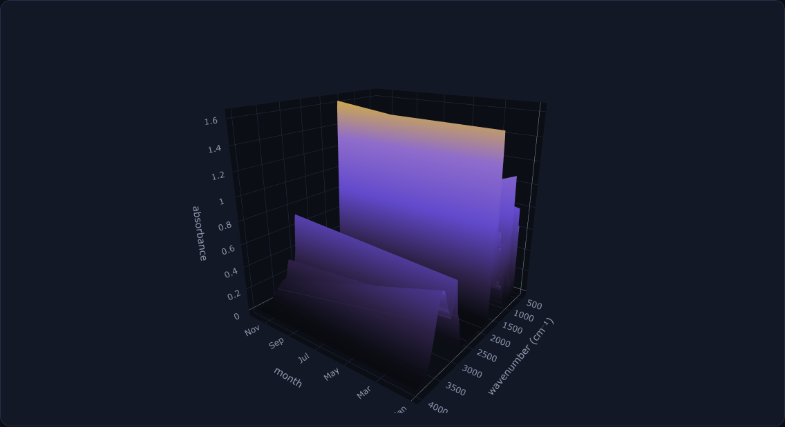

**Changes needed:**

---

## 08 · Mass-Defect Constellation

**File:** `08-mass-defect-map.html` · **Tag:** Nº 08 · MS

**Coloration:** Scatter points filled with `classify(substance).color`; radius scales with sample count. Axes/grid in `TOKENS.line` / `TOKENS.faint` / `TOKENS.muted`. Class legend. Tooltip may embed SmilesDrawer on `#0e1320` canvas.

**Logic:** D3 scatter of `DATA.top_substances` by exact mass and fractional or Kendrick (CH₂) mass defect. Toggle for Kendrick mode; hover tooltips with stats and optional 2D structure.

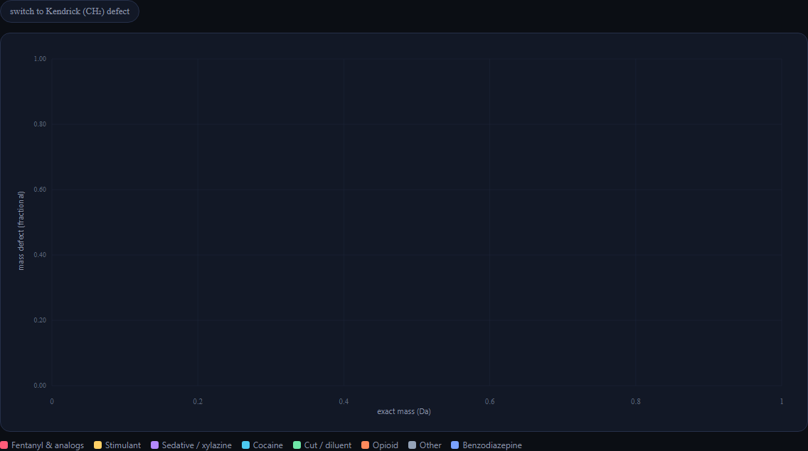

**Changes needed:**

---

## 09 · Hear the Spectrum

**File:** `09-sonification.html` · **Tag:** Nº 09 · EXPERIMENTAL

**Coloration:** Spectrum sticks use `classify(selected).color`. Animated playhead `TOKENS.ink`. Standard dark TOKENS UI chrome.

**Logic:** D3 renders MS stick spectrum or FTIR peak maxima; Web Audio API maps m/z or wavenumber to pitch and abundance to gain. Toggle MS vs FTIR; Play sweeps a left-to-right playhead firing tones sequentially.

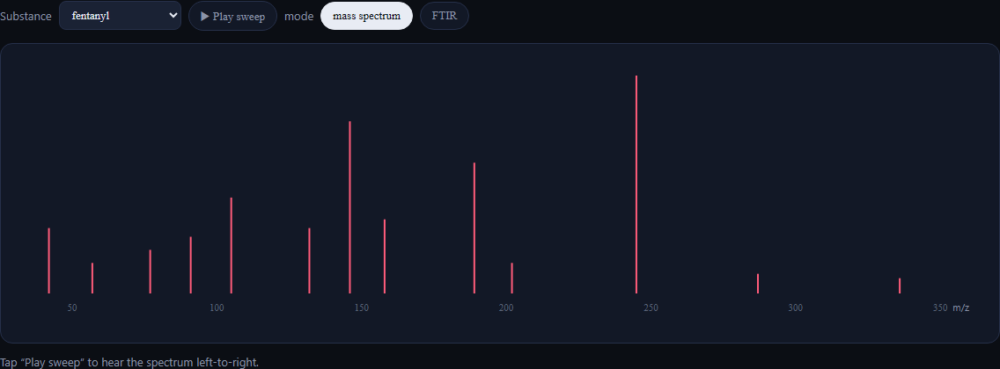

**Changes needed:**
This is a great direction, generate sonification variants for gc-ms data and expand the sample ms spectrums from the spectrum source library.
---

## 10 · Chemical-Space Drift

**File:** `10-chemical-space.html` · **Tag:** Nº 10 · EXPERIMENTAL

**Coloration:** Sample dots at 50% `classify(substance).color` opacity. Centroid path dashed `TOKENS.ink` with endpoint emphasis. Class swatch legend.

**Logic:** D3 scatter from precomputed 2D chemical-space coordinates per sample/month. Range slider selects rolling time window; centroid trail shows supply drift. Hover tooltips show month and class.

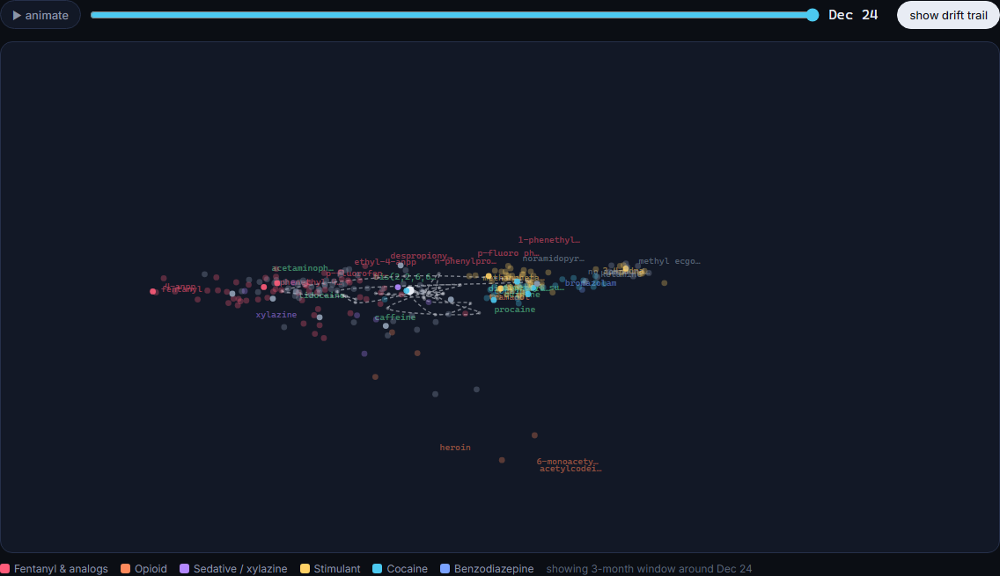

**Changes needed:**

---

## 11 · Supply Composition Streamgraph

**File:** `11-supply-streamgraph.html` · **Tag:** Nº 11 · SUPPLY

**Coloration:** Bands mapped to TOKENS class colors (fent, opioid, xyl, stim, coke, benzo, cut, other). Stroke `TOKENS.bg` between bands. Legend mirrors class labels.

**Logic:** D3 stack from `DATA.monthly_class` counts. Stream (wiggle) or percent (expand) offset toggle. Hover tooltips identify band class; quarterly month labels on x-axis.

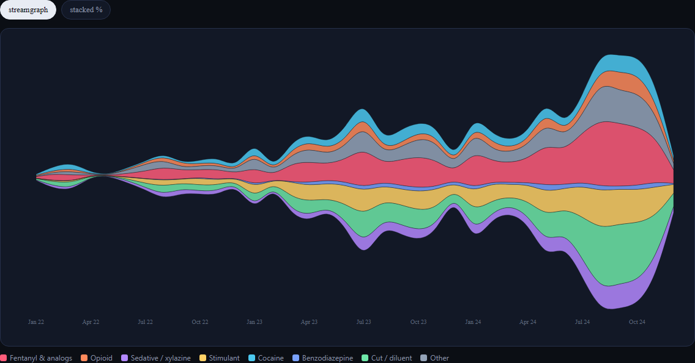

**Changes needed:**

---

## 12 · Adulterant Co-occurrence Chord

**File:** `12-cooccurrence-chord.html` · **Tag:** Nº 12 · SUPPLY

**Coloration:** Arcs and directed ribbons colored by `classify(topSubs[i]).color`; stroke `TOKENS.bg`. Non-hovered ribbon partners dim to 6% opacity.

**Logic:** D3 `chordDirected` from `DATA.cooccurrence` for top 16 substances. Hover an arc isolates ribbons; tooltips show co-occurrence sample counts.

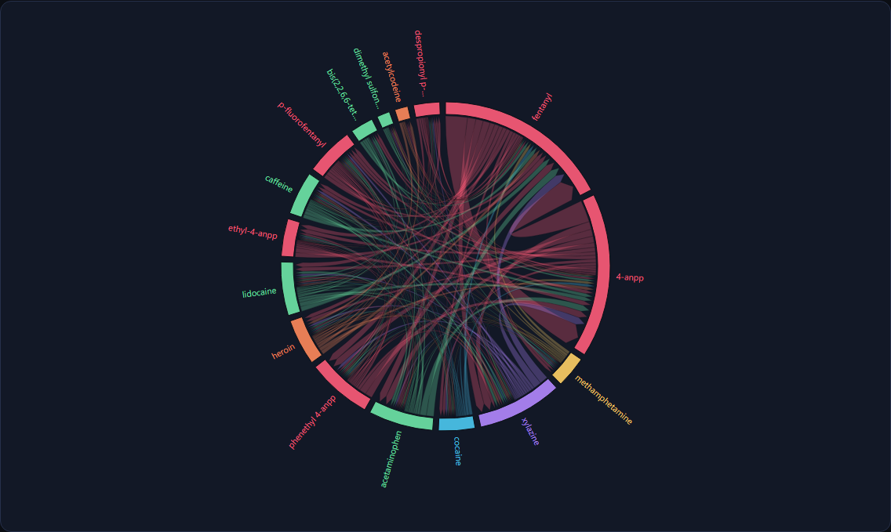

**Changes needed:**

---

## 13 · Expected vs. Detected

**File:** `13-expected-detected-sankey.html` · **Tag:** Nº 13 · SUPPLY

**Coloration:** Sankey nodes filled with `classify(name).color`. Links stroked in target class color at 40% opacity (75% on hover). Node labels `TOKENS.ink` with bg stroke halo.

**Logic:** `d3-sankey` layout from `DATA.expected_detected` flows. Left = expected substance, right = detected; link width ∝ sample count. Hover tooltips show flow direction and counts.

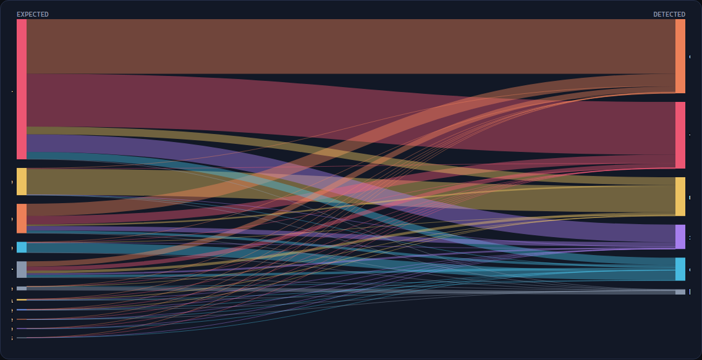

**Changes needed:**

---

## 14 · Substance Horizon Wall

**File:** `14-horizon-wall.html` · **Tag:** Nº 14 · SUPPLY

**Coloration:** Each substance row uses `classify(substance).color` in three stacked horizon bands at 25% / 55% / 85% opacity (darker = higher count). Row backgrounds `TOKENS.panel2`; labels `TOKENS.ink`.

**Logic:** D3 layered horizon areas per row from `DATA.monthly`, ranked ~22 substances by recent momentum. Hover shows substance, month, count; x-axis ticks every four months.

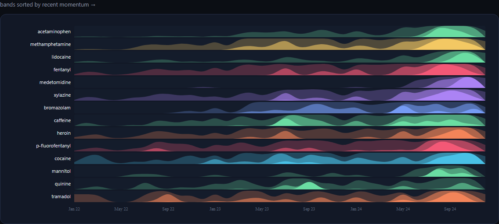

**Changes needed:**

---

## 15 · Novel-Substance Emergence Swarm

**File:** `15-emergence-beeswarm.html` · **Tag:** Nº 15 · SUPPLY

**Coloration:** Dots filled with `classify(substance).color`; radius scales with total detections. Large dots (>250) get `TOKENS.bg` text labels. Grid in `TOKENS.line` / `TOKENS.faint`.

**Logic:** `DATA.emergence` first-detection dates on time axis with `d3-forceSimulation` beeswarm collision. Class filter buttons (all/fent/benzo/xyl/opioid); hover tooltips show debut date and cumulative count.

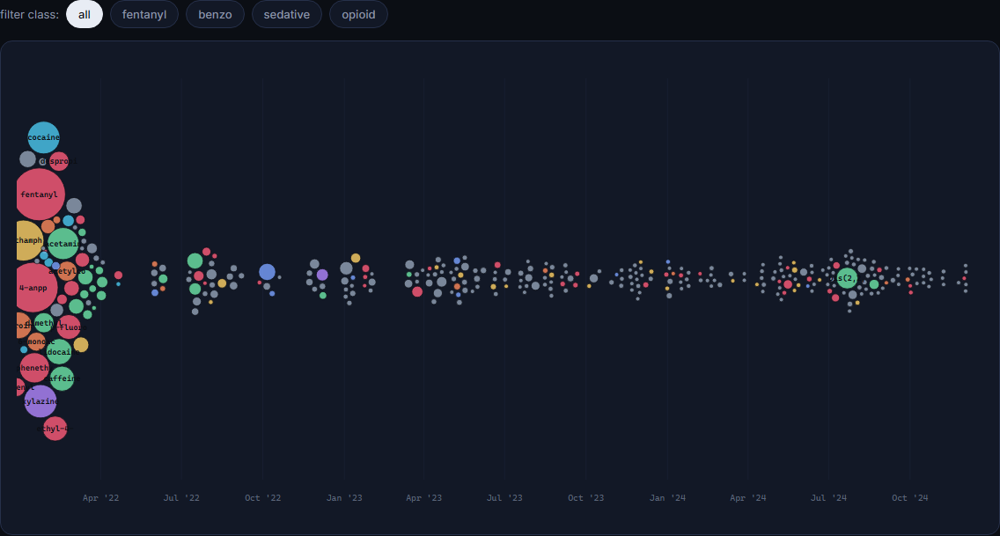

**Changes needed:**

---

## 16 · Supply Terrain (3D)

**File:** `16-supply-terrain-3d.html` · **Tag:** Nº 16 · SUPPLY

**Coloration:** Plotly colorscale `#0b0e14` → `#2a1a3a` → `#7a3a5a` → `#ff5c7a` → `#ff8a5c` → `#ffd166` encoding height. Dark scene `#0b0e14`, grid `#26304a`. No per-ridge `classify()` colors.

**Logic:** Plotly 3D surface: substance × month index × detection count from `DATA.monthly` (top 14 substances). Draggable camera; z-contour colormap.

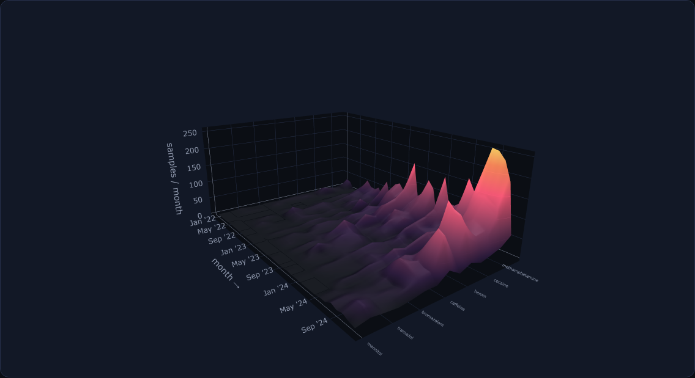

**Changes needed:**

---

## 17 · Adulterant Force Network

**File:** `17-adulterant-network.html` · **Tag:** Nº 17 · SUPPLY

**Coloration:** Nodes filled with `classify(id).color`; links stroked `TOKENS.line`, width scaled by co-occurrence. Legend shows unique class colors in graph.

**Logic:** `d3-forceSimulation` from `DATA.cooccurrence` among top 22 substances. Link distance/strength from co-occurrence; draggable nodes. Hover highlights incident links and shows role from `DATA.roles`.

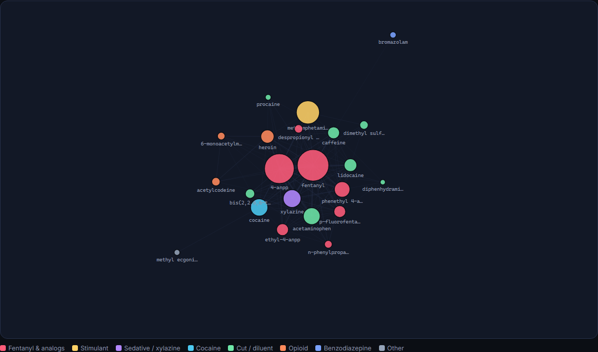

**Changes needed:**

---

## 18 · Sample Result Card

**File:** `18-result-card.html` · **Tag:** Nº 18 · RESULT

**Coloration:** Card chrome uses TOKENS panel/line/ink/muted/ok. Chromatogram tinted by primary substance `classify().color`. Component bars use per-substance class colors on `TOKENS.panel2` track. SmilesDrawer canvas `#0e1320`.

**Logic:** Dropdown selects illustrative `SAMPLES` composites tied to chromatogram archetypes. Builds HTML result card with summary, D3 mini-chromatogram, component bar chart, and harm-reduction bullets. Sample switching only interaction.

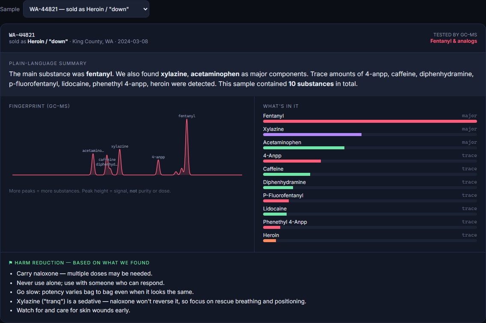

**Changes needed:**

---

## 19 · Expected-Reality Gap

**File:** `19-expected-reality-gap.html` · **Tag:** Nº 19 · RESULT

**Coloration:** Morphing chromatogram fill/stroke interpolates between `classify(expected).color` and `classify(detected-primary).color` via `d3.interpolateRgb`. Peak labels and badge follow morph state; grid `TOKENS.faint` / `TOKENS.muted`.

**Logic:** Scenario dropdown picks expected single-peak vs actual multi-component archetypes. D3 animates trace morph over 900 ms on "reveal reality" toggle; labels fade in past t=0.5. Caption updates with detected list.

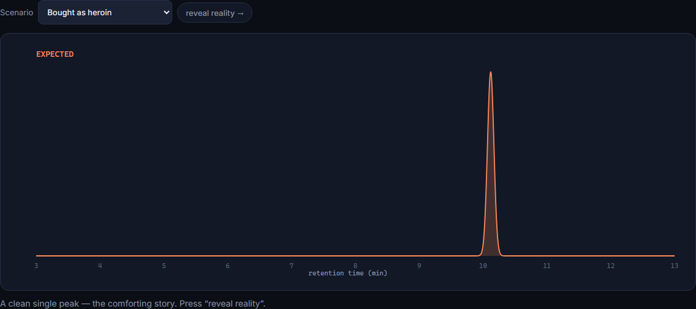

**Changes needed:**

---

## 20 · Potency Uncertainty Gauge

**File:** `20-potency-uncertainty.html` · **Tag:** Nº 20 · RESULT

**Coloration:** Gauge band gradient `TOKENS.ok` → `TOKENS.watch` → `TOKENS.alert`. Marker line/circle `TOKENS.ink`. Bar chart: `TOKENS.cut` (1 substance), `TOKENS.watch` (2–3), `TOKENS.alert` (4+).

**Logic:** Confidence slider widens/narrows plausible potency range around a stated claim. D3 horizontal gauge plus histogram of mixture complexity (distinct substances detected). No `classify()` on gauge itself.

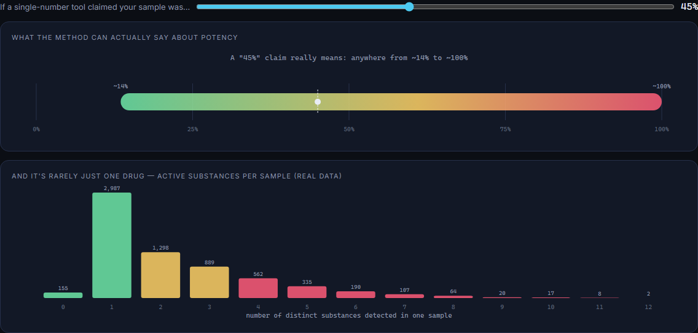

**Changes needed:**

---

## 21 · Supply Tile-Grid Cartogram

**File:** `21-geo-tilegrid.html` · **Tag:** Nº 21 · GEO

**Coloration:** Three metric modes: `d3.interpolateInferno` log-scale for testing volume; fentanyl mode `TOKENS.panel2` → `TOKENS.fent`; xylazine mode `TOKENS.panel2` → `TOKENS.xyl`. Empty states `TOKENS.panel2` at 25% opacity.

**Logic:** D3 rect tile grid for US states with `STATE_COUNTS` and `GEO` aggregates. Toggle buttons switch volume / % fentanyl / % xylazine fill. Hover tooltips show counts and positivity shares.

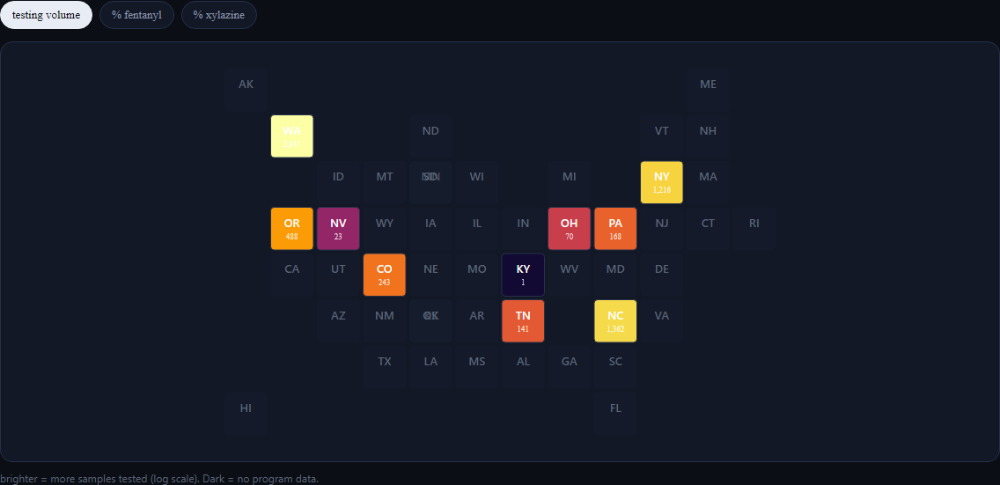

**Changes needed:**

---

## 22 · Xylazine Spread Timeline

**File:** `22-xylazine-spread.html` · **Tag:** Nº 22 · GEO

**Coloration:** Stacked area: `TOKENS.xyl` for primary detections; secondary layer interpolated `TOKENS.xyl` → `TOKENS.bg` at 45%. County bars `TOKENS.xyl` at 85% opacity.

**Logic:** D3 stacked area of xylazine primary vs secondary detections over months with play timeline. Bottom panel: horizontal bar chart of top counties for selected month from embedded geo data.

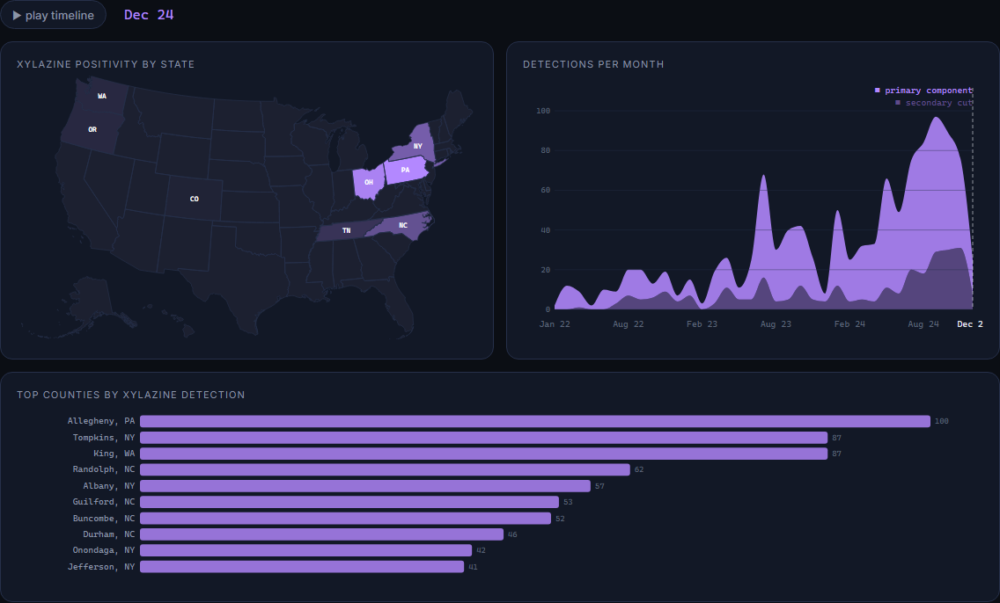

**Changes needed:**

---

## 23 · Structure Flipbook

**File:** `23-structure-flipbook.html` · **Tag:** Nº 23 · MS

**Coloration:** Each card top border uses `classify(substance).color`. Structure canvas background `#0e1320`; SmilesDrawer atom colors (N blue, O orange, halogen green). Filter toggles use default TOKENS `tgl` styling.

**Logic:** Grid of cards from `DATA.top_substances` filtered to substances with SMILES in `SPEC.ms`. Class filter buttons slice gallery; `drawSmiles()` via SmilesDrawer. Sorted by detection count descending.

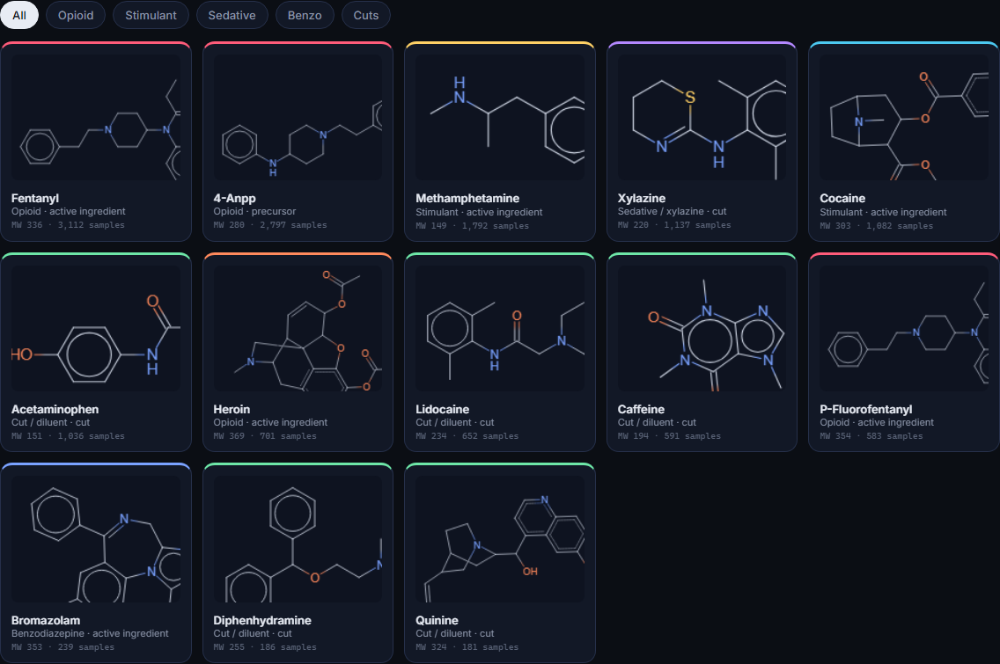

**Changes needed:**

---

## 24 · Anatomy of a Sample

**File:** `24-anatomy-scrolly.html` · **Tag:** Nº 24 · RESULT

**Coloration:** Sticky chromatogram trace tinted by dominant peak `classify().color` (16% fill, 1.7px stroke). Each peak marker/label uses its own class color; latest peak emphasized. Final step panel border `TOKENS.ok`.

**Logic:** Scrollytelling: `IntersectionObserver` on step divs rebuilds cumulative chromatogram from `STEPS` narrative as user scrolls. D3 draws building GC–MS trace with real retention times; left graphic sticky, right column holds step copy.

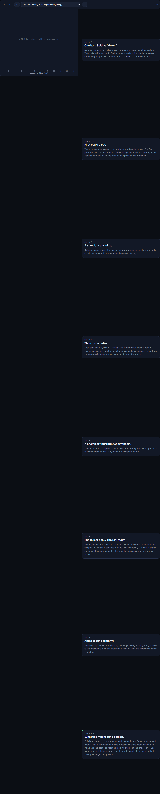

**Changes needed:**

---

## 25 · Sample Glyph Garden

**File:** `25-glyph-garden.html` · **Tag:** Nº 25 · EXPERIMENTAL

**Coloration:** Each petal stroke/fill uses `classify(substance).color` with opacity by frequency. Category labels `TOKENS.ink` / `TOKENS.faint`; center circle `TOKENS.panel2` with `TOKENS.line` stroke. Class legend from present categories.

**Logic:** Generates radial petal glyphs per expected-substance category from `ASSOC` mapping and sample counts. D3 SVG organic polygons per associated substance; hover tooltips show name, count, class. Regenerates on resize.

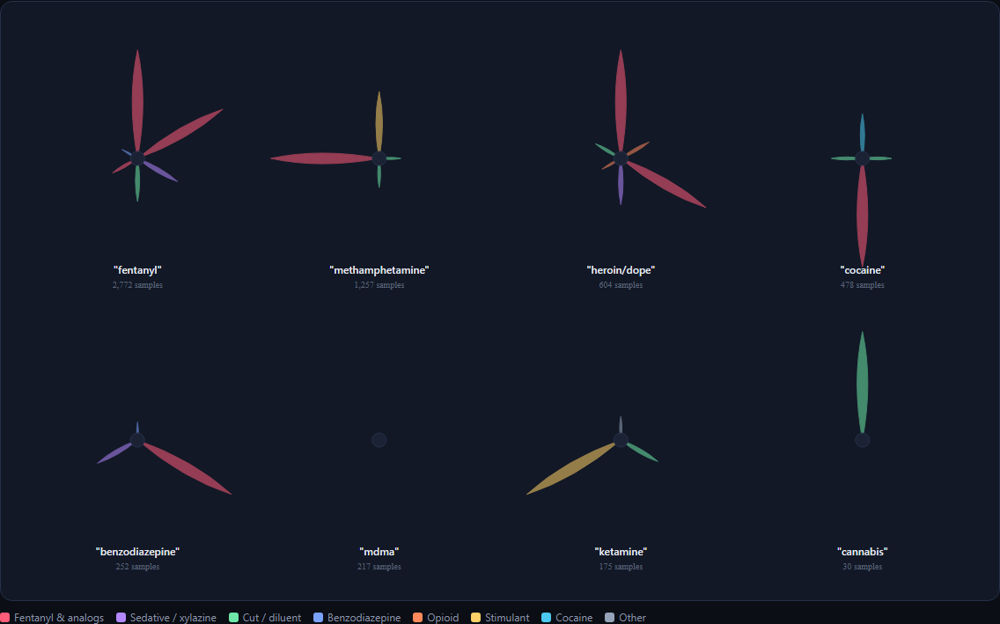

**Changes needed:**

---
